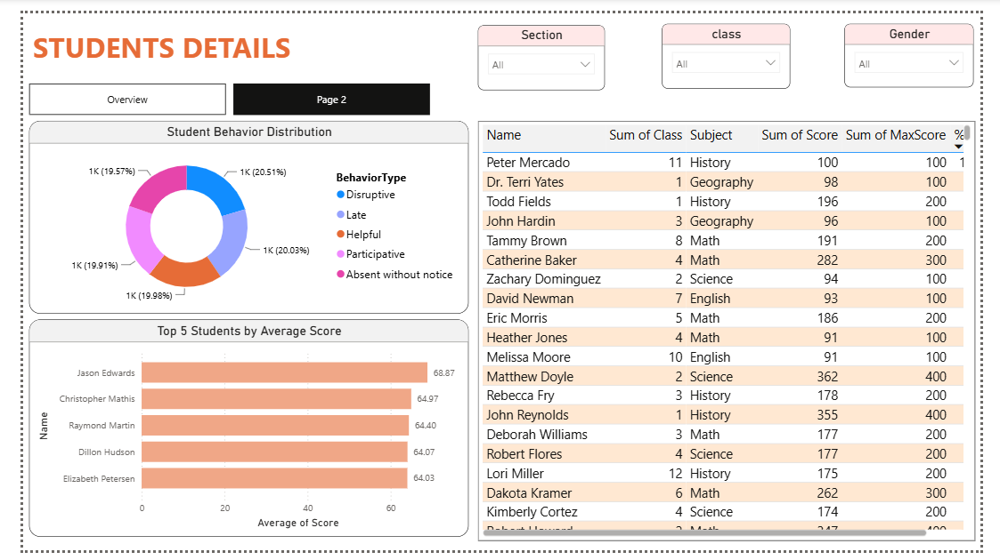
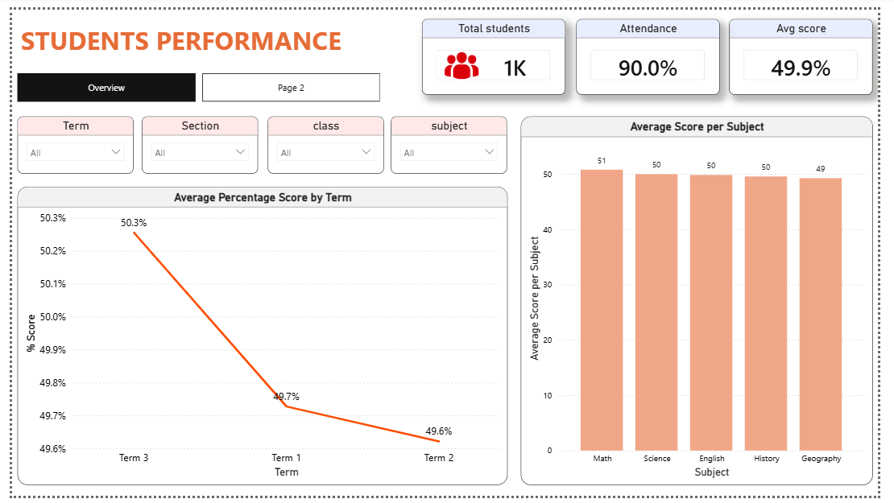

# 📊 Student Performance Dashboard (Power BI)

A Power BI dashboard that analyzes student academic performance, attendance, and classroom behavior using interactive visualizations and DAX measures.

This project demonstrates data modeling, data visualization, KPI reporting, and business intelligence concepts using Power BI.

---

# 📌 Project Overview

The Student Performance Dashboard helps educators and administrators monitor student performance by providing insights into:

- Academic scores
- Attendance percentage
- Student behavior
- Subject-wise performance
- Top-performing students
- Student details with interactive filtering

The dashboard contains two report pages:

- **Overview Dashboard**
- **Student Details Dashboard**

---

# 🎯 Objectives

- Monitor overall student performance
- Analyze attendance trends
- Compare subject-wise average scores
- Identify top-performing students
- Track student behavior
- Provide interactive reports using slicers

---

# 📂 Dataset

The project uses four related datasets.

## 1. Students

Contains student information.

Columns:
- StudentID
- Name
- Gender
- Class
- Section

---

## 2. Scores

Contains academic performance.

Columns:
- StudentID
- Subject
- Score
- MaxScore
- ExamType
- Performance Category

---

## 3. Attendance

Contains attendance records.

Columns:
- StudentID
- Date
- Status
- Reason

---

## 4. Behavior

Contains classroom behavior records.

Columns:
- StudentID
- Date
- BehaviorType
- Notes

---

# 🗂 Data Model

The project follows a Star Schema.

```
                Students
               /    |    \
              /     |     \
         Scores Attendance Behavior
```

Relationships:

- Students (1) → Scores (*)
- Students (1) → Attendance (*)
- Students (1) → Behavior (*)

StudentID is used as the primary relationship key.

---

# 📈 Dashboard Pages

## Page 1 — Student Performance Overview

This page provides high-level KPIs and performance trends.

### KPIs

- Total Students
- Attendance %
- Average Score %

### Filters

- Term
- Section
- Class
- Subject

### Visualizations

- Average Percentage Score by Term
- Average Score per Subject
- KPI Cards

---

## Page 2 — Student Details

Provides student-level analysis.

### Filters

- Section
- Class
- Gender

### Visualizations

- Student Behavior Distribution
- Top 5 Students by Average Score
- Student Details Table

---

# 📊 DAX Measures

The dashboard includes custom DAX measures such as:

### Total Students

```DAX
Total Students = DISTINCTCOUNT(Students[StudentID])
```

---

### Total Score

```DAX
Total Score = SUM(Scores[Score])
```

---

### Total Max Score

```DAX
Total Max Score = SUM(Scores[MaxScore])
```

---

### Score %

```DAX
% Score =
DIVIDE(
    [Total Score],
    [Total Max Score],
    0
)
```

---

### Average Score per Subject

```DAX
Average Score per Subject =
AVERAGE(Scores[Score])
```

---

### Attendance %

```DAX
Attendance % =
DIVIDE(
    CALCULATE(
        COUNTROWS(Attendance),
        Attendance[Status] = "Present"
    ),
    COUNTROWS(Attendance),
    0
)
```

---

# 📊 Features

✅ Interactive slicers

✅ Dynamic KPI Cards

✅ Subject-wise analysis

✅ Attendance tracking

✅ Student behavior insights

✅ Top performers

✅ Drill-down filtering

✅ Cross-filtering visuals

✅ Clean dashboard layout

---

# 📷 Dashboard Preview

## Student Performance Overview

- KPI Cards
- Subject Performance
- Average Score Trend
- Interactive Filters

---

## Student Details

- Behavior Distribution
- Top Students
- Student Detail Table
- Gender/Class Filters

---

# 🛠 Tools & Technologies

- Microsoft Power BI Desktop
- Power Query
- DAX (Data Analysis Expressions)
- Data Modeling
- CSV Dataset

---

# 📁 Project Structure

```
Student-Performance-Dashboard/

│
├── Student Performance Dashboard.pbix
├── README.md
├── Dataset/
│   ├── Students.csv
│   ├── Scores.csv
│   ├── Attendance.csv
│   └── Behavior.csv
│
├── Screenshots/
│   ├── Overview.png
│   ├── StudentDetails.png
│   └── DataModel.png
│
└── Assets/
```

---

# 📚 Skills Demonstrated

- Power BI Dashboard Development
- Data Cleaning
- Data Transformation
- Data Modeling
- Star Schema Design
- DAX Calculations
- KPI Design
- Interactive Reporting
- Business Intelligence
- Data Visualization

---

# 🚀 Business Insights

The dashboard enables users to:

- Identify high-performing students
- Monitor attendance performance
- Compare subjects by average score
- Analyze classroom behavior
- View detailed student records
- Filter results dynamically by class, section, subject, term, and gender

---

## Dashboard Screenshots

1ST page


2ND page



# 📌 Future Improvements

- Drill-through pages
- Student performance forecasting
- Monthly attendance trends
- Conditional formatting
- AI visual integration
- Exportable reports
- Mobile-optimized dashboard
- Row-Level Security (RLS)

---

# 👨‍💻 Author

**Nirpalsinh Solanki**

Power BI | Data Analytics | Python | SQL

GitHub:
(Add your GitHub profile link)

LinkedIn:
(Add your LinkedIn profile link)

---

# ⭐ If you found this project helpful, consider giving it a Star!
